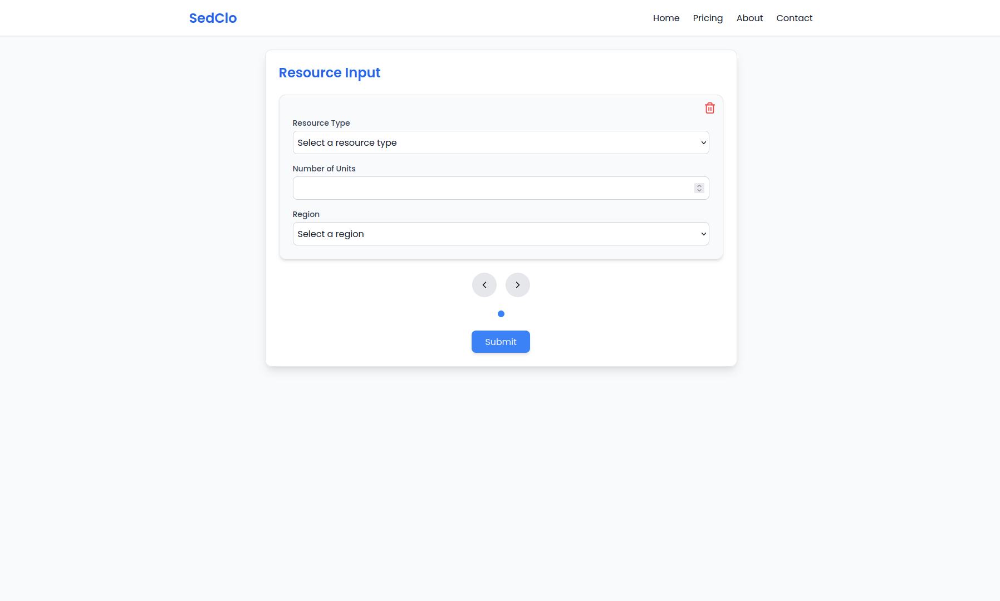

# Cloud Cost Estimator

A **full-stack web application** that helps users estimate cloud resource costs for computing, storage, and databases. Built using **React** for the frontend and **Spring Boot** for the backend.

---

## Features

- Add multiple cloud resources (EC2, RDS, Storage, etc.) and their configurations.
- Dynamically calculate **unit prices and total costs** for all resources.
- Smooth navigation between resources with **previous/next buttons** and **dot indicators**.
- Animated input cards using **Framer Motion**.
- Responsive and clean **light/dark theme options**.
- Billing-style result section with per-resource and total cost breakdown.

---

## Technologies Used

- **Frontend:** React, Tailwind CSS, Framer Motion, React Icons
- **Backend:** Java, Spring Boot
- **Database:** Optional (for persistent pricing data)
- **Other:** UUID for unique resource IDs, Fetch API for frontend-backend communication

---

## Screenshots

  
*Resource input form with navigation*  

  
*Pricing summary in a bill format*

---

## Installation

### Backend
1. Clone the repository:
   ```bash
   git clone https://github.com/ag-indulekha/sedklo.git
   cd backend
2. Build and run Spring Boot
   ```bash
   ./mvnw spring-boot:run
### Frontend
1. Navigate to the frontend library
   ```bash
   cd frontend
2. Install dependencies
   ```bash
   npm install
3. Start the react development server
   ```bash
   npm run start

## Usage
1. Open the app in your browser.
2. Fill in the resource type, sub-type, quantity, and region.
3. Use the Next/Prev buttons to navigate between multiple resources.
4. Click Submit to see the pricing breakdown at the bottom in a bill-style format.

## Demo Video 
[Watch Demo Video]([demo-video/demo-video.webm](https://drive.google.com/file/d/1XuSXhlpTFkYIjDOSIWGhnNByI3Zpcn3z/view?usp=sharing))

